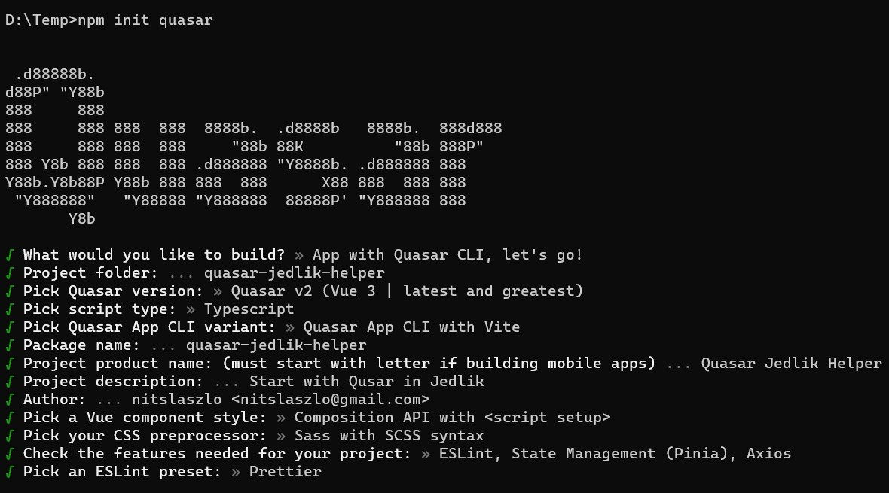

# Quasar Jedlik Helper (quasar-jedlik-helper)

## 1. Indulás a Quasar CLI-vel

> npm init quasar



Majd a Node csomagok telepítése:

> Install project dependencies? (recommended) » Yes, use npm

## 2. Törölhető javasolt (recommendations) bővítmények

> .vscode/extensions.json állományból:

- "editorconfig.editorconfig", (és a .editorconfig állomány a projekt root-ból)
- "wayou.vscode-todo-highlight"

## 3. Tasks.json állomány létrehozása

A .vscode mappába a következő tartalommal:

```
{
  // .vscode/tasks.json
  // See https://go.microsoft.com/fwlink/?LinkId=733558
  // for the documentation about the tasks.json format
  "version": "2.0.0",
  "tasks": [
    {
      "type": "npm",
      "script": "dev",
      "group": {
        "kind": "build",
        "isDefault": true
      }
    },
    {
      "type": "npm",
      "script": "test",
      "group": {
        "kind": "test",
        "isDefault": true
      }
    }
  ]
}
```

Ez után a projekt a **Ctrl-Shift-B** billentyű-kombinációval is futtatható, vagy:

> npm run dev

## 4. További néhány hasznos VS Code bővítmény és workspace beállítás

Javasolt bővítmények:

- TypeScript Vue Plugin (Volar)
- GitLens — Git supercharged
- Markdown All in One
- Quasar Docs
- vscode-pdf
- Git Branch Warnings

Beállítások a **.vscode/settings.json** állományba:

```
  "editor.mouseWheelZoom": true,
  "editor.wordWrap": "on",
  "editor.minimap.enabled": false,
  "files.autoSave": "afterDelay",
  "git.enableSmartCommit": true,
  "git.confirmSync": false,
  "git.autofetch": true,
  "git.autofetchPeriod": 60,
  "prettier.printWidth": 120,
```

## 5. Aposztróf helyett idézőjel használata string literáloknál

**.prettierrc** állományban:

```
  "singleQuote": false,
```

**.eslintrc.cjs** állományban:

```
    quotes: ["warn", "double", { avoidEscape: true }],
```

majd:

> npm run format

## 6. Nyomkövetés
A **launch.json** állomány létrehozása a .vscode mappába a következő tartalommal:
```
{
  // Use IntelliSense to learn about possible attributes.
  // Hover to view descriptions of existing attributes.
  // For more information, visit: https://go.microsoft.com/fwlink/?linkid=830387
  "version": "0.2.0",
  "configurations": [
    {
      "type": "msedge",
      "request": "launch",
      "name": "Quasar App: Edge",
      "url": "http://localhost:9000",
      // To properly reflect changes after HMR with Vite
      "enableContentValidation": false,
      "webRoot": "${workspaceFolder}/src",
      // No need to configure sourcemap explicitly for vite.
      "sourceMapPathOverrides": {
        "webpack://package-name/./src/*": "${webRoot}/*"
      },
      "skipFiles": [
        "${workspaceFolder}/node_modules/**/*"
      ]
    },
    {
      "type": "chrome",
      "request": "launch",
      "name": "Quasar App: Chrome",
      "url": "http://localhost:9000",
      // To properly reflect changes after HMR with Vite
      "enableContentValidation": false,
      "webRoot": "${workspaceFolder}/src",
      // No need to configure sourcemap explicitly for vite.
      "sourceMapPathOverrides": {
        "webpack://package-name/./src/*": "${webRoot}/*"
      },
      "skipFiles": [
        "${workspaceFolder}/node_modules/**/*"
      ]
    }
  ]
}
```

1. Indítsad el a fordítást a **Ctrl-Shift-B**-vel, vagy az "npm run dev" paranccsal
2. Zárjad be a megjelenő böngészőablakot (ha megjelenik)
3. Indítsad el az alkalmazást debug-módban az **F5**-el
4. A forrás megnyitása után helyezz el a vizsgálni kívánt kódsorok elé töréspontokat (piros pontok)
5. Navigálj úgy az alkalmazásban, hogy a kódsorok végrehajtásra kerüljenek
6. Vizsgáld a változók tartalmát, figyeld/folytasd a programsorok végrehajtását (**F10**, **F11**, **F5**)

## 7. Hasznos Qusar pluginek

A **quasar.config.js** állományt kell bővíteni:

```
    framework: {
      config: {},
      // ...
      // Quasar plugins
      plugins: ["Notify", "Dialog", "Loading", "LocalStorage"],
    },
```
Néhány példa használatukra (Loading, Notify) az **ExampleComponent.vue** állományban.

See [Configuring quasar.config.js](https://v2.quasar.dev/quasar-cli-vite/quasar-config-js).
